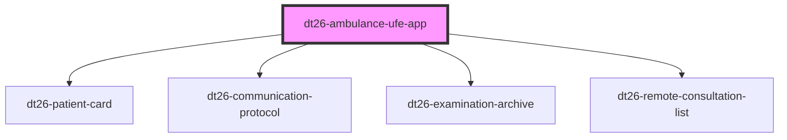

# dt26-ambulance-ufe-app

<!-- Auto Generated Below -->

## Properties

| Property      | Attribute      | Description | Type     | Default     |
| ------------- | -------------- | ----------- | -------- | ----------- |
| `ambulanceId` | `ambulance-id` |             | `string` | `undefined` |
| `apiBase`     | `api-base`     |             | `string` | `undefined` |
| `basePath`    | `base-path`    |             | `string` | `""`        |

## Dependencies

### Depends on

- [dt26-patient-card](../dt26-patient-card)
- [dt26-communication-protocol](../dt26-communication-protocol)
- [dt26-examination-archive](../dt26-examination-archive)
- [dt26-remote-consultation-list](../dt26-remote-consultation-list)

### Graph

----------------------------------------------

*Built with [StencilJS](https://stenciljs.com/)*
